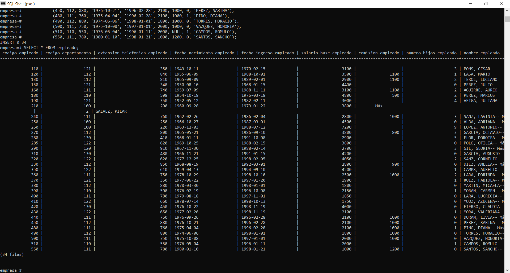

# PRÁCTICA SELECT
## HOJA 1

**Implementar company.sql (_empresa_) en la base de datos.**
```sql
postgres=# create DATABASE empresa owner postgres;
CREATE DATABASE
postgres=# \c empresa postgres;
Ahora está conectado a la base de datos «empresa» con el usuario «postgres».
```

**1. Mostrar toda la información de la tabla empleado.**
```sql
empresa=# SELECT * FROM empleado;
```


**2. Mostrar códigos de departamento distintos de la tabla empleado.**
```sql
empresa=# SELECT codigo_departamento FROM empleado;
 codigo_departamento
---------------------
                 121
                 112
                -- Más  --
                 110
                 111
(34 filas)
```

**3. Listar los empleados en el orden ascendente de sus salarios.**

>En una base de datos "normal" no pueden existir atributos de tipo primitivo (NUMERIC con 
>decimal es un DOUBLE) siendo NULL, se les debería haber colocado un 0 por defecto para 
>no complicar el trabajo al resto. 
>Por lo que para sacar la suma de ambos salarios he buscado información de la función
>SUM(). Dí con esta [página](https://www.postgresqltutorial.com/postgresql-sum-function/) donde introducen la función de COALESCE() que sirve para
>que el resultado no retorne NULL haciendo conversión de NULL a 0. 

```sql
empresa=# SELECT nombre_empleado, SUM(salario_base_empleado + COALESCE(comision_empleado, 0)) as salario_total FROM empleado
empresa-# GROUP BY nombre_empleado
empresa-# ORDER BY salario_total ASC;
 nombre_empleado  | salario_total
------------------+---------------
 MUOZ, AZUCENA    |          1750
 MARTIN, MICAELA  |          1800
 LARA, LUCRECIA   |          1850
-- Más  --
 GARCIA, OCTAVIO  |          4600
 PEREZ, MARCOS    |          5300
 LOPEZ, ANTONIO   |          7200
(34 filas)

```

**4. Muestra el nombre y fecha de nacimiento de todos los empleados.**
 ```sql
empresa=# SELECT nombre_empleado, fecha_nacimiento_empleado FROM empleado;
 nombre_empleado  | fecha_nacimiento_empleado
------------------+---------------------------
 PONS, CESAR      | 1949-10-11
 LASA, MARIO      | 1955-06-09
 TEROL, LUCIANO   | 1965-09-09
 PEREZ, JULIO     | 1950-08-10
 AGUIRRE, AUREO   | 1959-07-09
 PEREZ, MARCOS    | 1954-10-18
 VEIGA, JULIANA   | 1952-05-12
-- Más  --
 CAMPOS, ROMULO   | 1976-05-04
 SANTOS, SANCHO   | 1980-01-10
(34 filas)
 ```

 **5. Muestre los nombres de todos los empleados que trabajan en FINANZAS y reciben un salario de más de 1500.**
```sql
empresa=# SELECT nombre_empleado FROM empleado
empresa-# WHERE codigo_departamento = 130 AND salario_base_empleado > 1500;
 nombre_empleado
-----------------
 FLOR, DOROTEA
 GARCIA, AUGUSTO
 FIERRO, CLAUDIA
(3 filas)
```

**6. Muestre el número y el nombres de los empleados que ganan comisiones.**
```sql
empresa=# SELECT codigo_empleado, nombre_empleado FROM empleado
empresa-# WHERE comision_empleado IS NOT NULL;
 codigo_empleado | nombre_empleado
-----------------+------------------
             120 | LASA, MARIO
             130 | TEROL, LUCIANO
             160 | AGUIRRE, AUREO
             180 | PEREZ, MARCOS
             240 | SANZ, LAVINIA
             270 | GARCIA, OCTAVIO
             330 | DIEZ, AMELIA
             360 | LARA, DORINDA
             440 | DURAN, LIVIA
             450 | PEREZ, SABINA
             480 | PINO, DIANA
             490 | TORRES, HORACIO
             500 | VAZQUEZ, HONORIA
             550 | SANTOS, SANCHO
(14 filas)
```

**7. Mostrar el nombre de los empleados que no ganan ninguna comisión.**
```sql
empresa=# SELECT nombre_empleado, salario_base_empleado FROM empleado
empresa-# WHERE comision_empleado IS NULL;
 nombre_empleado | salario_base_empleado
-----------------+-----------------------
 PONS, CESAR     |                  3100
 PEREZ, JULIO    |                  4400
-- Más  --
 FIERRO, CLAUDIA |                  4000
 MORA, VALERIANA |                  2100
 CAMPOS, ROMULO  |                  2000
(20 filas)
```

8. Muestre el nombre de los empleados que trabajan como FINANZAS, ORGANIZACION o PROCESO DE DATOS y su salario más de 3000.
```sql

```

**9. Muestre la lista de empleados que se han unido a la empresa antes del 30 de junio de 1.990 o después del 31 de diciembre de 1.997.**
```sql
empresa=# SELECT fecha_ingreso_empleado FROM empleado
empresa-# WHERE fecha_ingreso_empleado < '1990-06-30'
empresa-# OR fecha_ingreso_empleado > '1997-12-31';
 fecha_ingreso_empleado
------------------------
 1970-02-15
 1988-10-01
-- Más  --
 1998-01-01
 1998-01-21
(22 filas)
```

**10. Mostrar la fecha actual.**
```sql
empresa=# SELECT CURRENT_DATE ;
 current_date
--------------
 2021-02-17
(1 fila)
```

**11. Listado de los detalles de los empleados en orden ascendente de los departamentos y descendiente de la fecha de ingreso.**
```sql
empresa=# SELECT codigo_empleado, nombre_empleado, codigo_departamento, fecha_ingreso_empleado
empresa-# FROM empleado
empresa-# ORDER BY codigo_departamento ASC,
empresa-#     fecha_ingreso_empleado DESC;
 codigo_empleado | nombre_empleado  | codigo_departamento | fecha_ingreso_empleado
-----------------+------------------+---------------------+------------------------
             260 | LOPEZ, ANTONIO   |                 100 | 1988-07-12
             250 | ALBA, ADRIANA    |                 100 | 1987-03-01
             210 | GALVEZ, PILAR    |                 100 | 1979-01-22
             390 | MORAN, CARMEN    |                 110 | 1996-10-08
             -- Más  --
             350 | CAMPS, AURELIO   |                 122 | 1994-09-10
             285 | POLO, OTILIA     |                 122 | 1988-02-15
             420 | FIERRO, CLAUDIA  |                 130 | 1998-11-19
             280 | FLOR, DOROTEA    |                 130 | 1991-10-08
             310 | GARCIA, AUGUSTO  |                 130 | 1991-01-15
(34 filas)
```

**12. ¿Que empleados se unieron antes de 1.991?**

>He dado por hecho que 1991 no inclusive

```sql
empresa=# SELECT codigo_empleado, nombre_empleado, fecha_ingreso_empleado FROM empleado
empresa-# WHERE fecha_ingreso_empleado < '1991-01-01';
 codigo_empleado | nombre_empleado | fecha_ingreso_empleado
-----------------+-----------------+------------------------
             110 | PONS, CESAR     | 1970-02-15
             120 | LASA, MARIO     | 1988-10-01
             130 | TEROL, LUCIANO  | 1989-02-01
             -- Más  --
             270 | GARCIA, OCTAVIO | 1986-09-10
             285 | POLO, OTILIA    | 1988-02-15
             290 | GIL, GLORIA     | 1988-02-14
(14 filas)
```

**13. Código, nombre, salario de todos los empleados que no tienen hijos.**
```sql
empresa=# SELECT codigo_empleado, nombre_empleado, SUM(salario_base_empleado + COALESCE(comision_empleado, 0)) as salario_total, numero_hijos_empleado
empresa-# FROM empleado
empresa-# WHERE numero_hijos_empleado = 0
empresa-# GROUP BY nombre_empleado, codigo_empleado;
 codigo_empleado | nombre_empleado  | salario_total | numero_hijos_empleado
-----------------+------------------+---------------+-----------------------
             150 | PEREZ, JULIO     |          4400 |                     0
             250 | ALBA, ADRIANA    |          4500 |                     0
             285 | POLO, OTILIA     |          3800 |                     0
            -- Más  --
             490 | TORRES, HORACIO  |          2800 |                     0
             500 | VAZQUEZ, HONORIA |          3000 |                     0
             550 | SANTOS, SANCHO   |          2200 |                     0
(14 filas)
```

**14. Muestra todos los detalles de los empleados cuya comision es mayor que su salario.**
```sql
empresa=# SELECT codigo_empleado, nombre_empleado, comision_empleado FROM empleado
empresa-# WHERE comision_empleado > salario_base_empleado;
 codigo_empleado | nombre_empleado | comision_empleado
-----------------+-----------------+-------------------
             550 | SANTOS, SANCHO  |              1200
(1 fila)
```

**15. Empleados en el orden ascendente de departamento de aquellos empleados que se incorporaron después de la segunda mitad de 1.998.**
```sql
empresa=# SELECT codigo_empleado, nombre_empleado, codigo_departamento FROM empleado
empresa-# WHERE fecha_ingreso_empleado BETWEEN '1998-06-01' AND '1998-12-31'
empresa-# ORDER BY codigo_departamento ASC;
 codigo_empleado | nombre_empleado | codigo_departamento
-----------------+-----------------+---------------------
             360 | LARA, DORINDA   |                 111
             410 | MUOZ, AZUCENA   |                 122
             430 | MORA, VALERIANA |                 122
             420 | FIERRO, CLAUDIA |                 130
(4 filas)
```

**16. Liste el nombre, salario y el número de meses en la compañía de los empleados que su salario diario es mayor que 70.**
```sql
empresa=# SELECT nombre_empleado,
empresa-#     ROUND(SUM(salario_base_empleado + COALESCE(comision_empleado, 0))/30, 2) as salario_diario,
empresa-#     date_part('year', age(now(), fecha_ingreso_empleado))*12 + EXTRACT(month from age(now(), fecha_ingreso_empleado)) as meses
empresa-# FROM empleado
empresa-# WHERE ROUND((salario_base_empleado + COALESCE(comision_empleado, 0)/30),2) >= 70.00
empresa-# GROUP BY nombre_empleado, meses;
 nombre_empleado  | salario_diario| meses
------------------+---------------+-------
 GIL, GLORIA      |         90.00 |   396
 MORAN, CARMEN    |         71.67 |   292
 POLO, OTILIA     |        126.67 |   396
 LARA, DORINDA    |        116.67 |   268
-- Más --
 GALVEZ, PILAR    |        126.67 |   504
 PEREZ, JULIO     |        146.67 |   637
 DIEZ, AMELIA     |        123.33 |   347
 LOPEZ, ANTONIO   |        240.00 |   391
(34 filas)
```

**17. Enumere los empleados que son "ORGANIZACION" o "PROCESO DE DATOS" en orden descendiente de su nombre.**
```sql
empresa=# SELECT nombre_empleado, codigo_departamento FROM empleado
empresa-# WHERE codigo_departamento = 120
empresa-# OR codigo_departamento = 122
empresa-# ORDER BY nombre_empleado DESC;
 nombre_empleado | codigo_departamento
-----------------+---------------------
 SANZ, CORNELIO  |                 122
 POLO, OTILIA    |                 122
 MUOZ, AZUCENA   |                 122
 MORA, VALERIANA |                 122
 GIL, GLORIA     |                 120
 CAMPS, AURELIO  |                 122
(6 filas)
```

**18. Enumere los empleados que trabajan para el DEPARTAMENTO 110 o 120.**
```sql
empresa=# SELECT codigo_empleado, nombre_empleado, codigo_departamento FROM empleado
empresa-# WHERE codigo_departamento = 110
empresa-# OR codigo_departamento = 120;
 codigo_empleado | nombre_empleado | codigo_departamento
-----------------+-----------------+---------------------
             180 | PEREZ, MARCOS   |                 110
             290 | GIL, GLORIA     |                 120
             390 | MORAN, CARMEN   |                 110
             510 | CAMPOS, ROMULO  |                 110
(4 filas)
```

**19. Enumere los empleados que se unieron en el mes de agosto.**

>Mirando los datos de los empleados, nadie ingresó en el mes de Agosto.

```sql
empresa=# SELECT nombre_empleado, fecha_ingreso_empleado FROM empleado
empresa-# WHERE EXTRACT(MONTH FROM fecha_ingreso_empleado) = 08;
 nombre_empleado | fecha_ingreso_empleado
-----------------+------------------------
(0 filas)
```

**20. Liste los empleados cuyo salario anual está entre 25.000 y 35.000.**

```sql
empresa=# SELECT nombre_empleado,
empresa-#     SUM((salario_base_empleado + COALESCE(comision_empleado, 0))*12) as salario_total_anual
empresa-# FROM empleado
empresa-# WHERE ((salario_base_empleado + COALESCE(comision_empleado, 0))*12) BETWEEN 25000 AND 35000
empresa-# GROUP BY nombre_empleado;
 nombre_empleado | salario_total_anual
-----------------+---------------------
 FLOR, DOROTEA   |               34800
 GIL, GLORIA     |               32400
 MORA, VALERIANA |               25200
 MORAN, CARMEN   |               25800
 SANTOS, SANCHO  |               26400
 TORRES, HORACIO |               33600
(6 filas)
```


**21. Nombres de empleados que tienen cinco caracteres en sus nombres.**
```sql
empresa=# SELECT nombre_empleado
empresa-# FROM empleado
empresa-# WHERE nombre_empleado LIKE '%, _____';
 nombre_empleado
-----------------
 PONS, CESAR
 LASA, MARIO
 PEREZ, JULIO
 AGUIRRE, AUREO
 GALVEZ, PILAR
 DURAN, LIVIA
 PINO, DIANA
(7 filas)
```

**22. Nombres de empleados que comienzan con "A" y con 7 caracteres.**

```sql
empresa=# SELECT nombre_empleado FROM empleado
empresa-# WHERE nombre_empleado LIKE '%, A______';
 nombre_empleado
-----------------
 ALBA, ADRIANA
 LOPEZ, ANTONIO
 GARCIA, AUGUSTO
 CAMPS, AURELIO
 MUOZ, AZUCENA
(5 filas)
```

**23. Empleados que cuya tercera letra del apellido es una "R".**
```sql
empresa=# SELECT nombre_empleado FROM empleado
empresa-# WHERE nombre_empleado LIKE '__R%';
 nombre_empleado
-----------------
 TEROL, LUCIANO
 PEREZ, JULIO
 PEREZ, MARCOS
 GARCIA, OCTAVIO
 GARCIA, AUGUSTO
 LARA, DORINDA
 MARTIN, MICAELA
 MORAN, CARMEN
 LARA, LUCRECIA
 MORA, VALERIANA
 DURAN, LIVIA
 PEREZ, SABINA
 TORRES, HORACIO
(13 filas)
```

**24. Cinco nombres de empleados cuyo apellido comienza con "G" y termina con "Z".**
```sql
empresa=# SELECT nombre_empleado FROM empleado
empresa-# WHERE nombre_empleado LIKE 'G%Z%';
 nombre_empleado
-----------------
 GALVEZ, PILAR
(1 fila)
```

**25. Haz una lista de los empleados que se unieron en el mes cuyo segunda letra es una "A".**
```sql
empresa=# SELECT nombre_empleado, fecha_ingreso_empleado FROM empleado
empresa-# WHERE EXTRACT( MONTH FROM fecha_ingreso_empleado) = 04
empresa-# OR EXTRACT( MONTH FROM fecha_ingreso_empleado) = 09;
 nombre_empleado | fecha_ingreso_empleado
-----------------+------------------------
 GARCIA, OCTAVIO | 1986-09-10
 CAMPS, AURELIO  | 1994-09-10
(2 filas)
```

**26. Enumere los empleados cuyo salario es un número de cuatro dígitos que empieza por 2.**
```sql
empresa=# SELECT nombre_empleado, SUM(salario_base_empleado + COALESCE(comision_empleado, 0)) as salario_total
empresa-# FROM empleado
empresa-# WHERE CAST(salario_base_empleado + COALESCE(comision_empleado, 0) as TEXT) LIKE '2___'
empresa-# GROUP BY nombre_empleado;
 nombre_empleado | salario_total
-----------------+---------------
 CAMPOS, ROMULO  |          2000
 FLOR, DOROTEA   |          2900
 GIL, GLORIA     |          2700
 MORA, VALERIANA |          2100
 MORAN, CARMEN   |          2150
 SANTOS, SANCHO  |          2200
 TORRES, HORACIO |          2800
(7 filas)
```

**27. Enumere los empleados que no pertenecen al departamento 111.**
```sql
empresa=# SELECT codigo_empleado, codigo_departamento FROM empleado
empresa-# WHERE CAST(codigo_departamento as TEXT) NOT LIKE '111';
 codigo_empleado | codigo_departamento
-----------------+---------------------
             110 |                 121
             120 |                 112
             130 |                 112
             150 |                 121
-- Más --
             430 |                 122
             450 |                 112
             490 |                 112
             510 |                 110
(26 filas)
```

**28. Enumere todos los empleados excepto "DIRECCION" y "ORGANIZACION" en orden ascendente de salarios.**
```sql
empresa=# SELECT codigo_empleado, nombre_empleado, SUM(salario_base_empleado + COALESCE(comision_empleado, 0)) as salario_total
empresa-# FROM empleado
empresa-# WHERE codigo_departamento <> 110 AND codigo_departamento <> 100 AND codigo_departamento <> 120
empresa-# GROUP BY codigo_empleado, nombre_empleado
empresa-# ORDER BY salario_base_empleado + COALESCE(comision_empleado, 0) ASC;
 codigo_empleado | nombre_empleado  | salario_total
-----------------+------------------+---------------
             410 | MUOZ, AZUCENA    |          1750
             380 | MARTIN, MICAELA  |          1800
             400 | LARA, LUCRECIA   |          1850
             370 | RUIZ, FABIOLA    |          1900
-- Más --
             150 | PEREZ, JULIO     |          4400
             350 | CAMPS, AURELIO   |          4500
             270 | GARCIA, OCTAVIO  |          4600
             120 | LASA, MARIO      |          4600
(27 filas)
```
**29. Enumere todos los empleados que se unieron antes o después de 1.996, pero no en 1.996.**
```sql
empresa=# SELECT nombre_empleado, fecha_ingreso_empleado
empresa-# FROM empleado
empresa-# WHERE EXTRACT(YEAR FROM fecha_ingreso_empleado) <> 1996;
 nombre_empleado  | fecha_ingreso_empleado
------------------+------------------------
 PONS, CESAR      | 1970-02-15
 LASA, MARIO      | 1988-10-01
 TEROL, LUCIANO   | 1989-02-01
 PEREZ, JULIO     | 1968-01-15
-- Más --
 MORA, VALERIANA  | 1998-11-19
 TORRES, HORACIO  | 1998-01-01
 VAZQUEZ, HONORIA | 1997-01-01
 SANTOS, SANCHO   | 1998-01-21
(29 filas)
```

**30. Enumere los empleados que se unieron en cualquier año pero que no en el mes de marzo.**

>El mes de Marzo es el número 03.

```sql
empresa=# SELECT nombre_empleado, fecha_ingreso_empleado
empresa-# FROM empleado
empresa-# WHERE EXTRACT(MONTH FROM fecha_ingreso_empleado) <> 03;
 nombre_empleado  | fecha_ingreso_empleado
------------------+------------------------
 PONS, CESAR      | 1970-02-15
 LASA, MARIO      | 1988-10-01
 TEROL, LUCIANO   | 1989-02-01
 PEREZ, JULIO     | 1968-01-15
-- Más --
 TORRES, HORACIO  | 1998-01-01
 VAZQUEZ, HONORIA | 1997-01-01
 CAMPOS, ROMULO   | 1996-01-11
 SANTOS, SANCHO   | 1998-01-21
(31 filas)
```

**31. Enumere los empleados de departamento 111 o 112 y que ingresaron en la compañía en 1.996.**

>En principio había usado los OR y AND pero no conseguía que el enunciado booleano hiciera
>lo que debería, entonces aprovechando que ambos departamentos están lo suficientemente
>cerca para que no interfiera otro código departamento, usar un BETWEEN me parecía lo mejor para
>lo que se estaba buscando.

```sql
empresa=# SELECT codigo_empleado, nombre_empleado, codigo_departamento, fecha_ingreso_empleado
empresa-# FROM empleado
empresa-# WHERE EXTRACT(YEAR FROM fecha_ingreso_empleado) = 1996
empresa-# AND codigo_departamento BETWEEN 111 AND 112;
 codigo_empleado | nombre_empleado | codigo_departamento | fecha_ingreso_empleado
-----------------+-----------------+---------------------+------------------------
             440 | DURAN, LIVIA    |                 111 | 1996-02-28
             450 | PEREZ, SABINA   |                 112 | 1996-02-28
             480 | PINO, DIANA     |                 111 | 1996-02-28
(3 filas)
```

**32. Muestra los nombres de los empleados que no trabajan como ORGANIZACION.**
```sql
empresa=# SELECT nombre_empleado FROM empleado
empresa-# WHERE codigo_departamento <> 120;
 nombre_empleado
------------------
 PONS, CESAR
 LASA, MARIO
 TEROL, LUCIANO
 PEREZ, JULIO
-- Más --
 TORRES, HORACIO
 VAZQUEZ, HONORIA
 CAMPOS, ROMULO
 SANTOS, SANCHO
(33 filas)
```

**33. Muestre los nombres de los empleados que no trabajan como ORGANIZACION o DIRECCION.**
```sql
empresa=# SELECT nombre_empleado FROM empleado
empresa-# WHERE NOT codigo_departamento = 120
empresa-# AND NOT codigo_departamento = 110
empresa-# AND NOT codigo_departamento = 100;
 nombre_empleado
------------------
 PONS, CESAR
 LASA, MARIO
 TEROL, LUCIANO
 PEREZ, JULIO
-- Más --
 PINO, DIANA
 TORRES, HORACIO
 VAZQUEZ, HONORIA
 SANTOS, SANCHO
(27 filas)
```

**34. Muestra el número total de empleados que trabajan en la empresa.**
```sql
empresa=# SELECT COUNT(nombre_empleado) FROM empleado;
 count
-------
    34
(1 fila)
```
**35. Muestra el salario total que se paga a todos los empleados.**
```sql
empresa=# SELECT SUM(salario_base_empleado + COALESCE(comision_empleado, 0)) as salario_total
empresa-# FROM empleado;
 salario_total
---------------
        116700
(1 fila)
```
**36. Muestra el salario máximo, salario mínimo y el salario promedio de la tabla empleado.**
```sql
empresa=# SELECT ROUND(AVG(salario_base_empleado + COALESCE(comision_empleado, 0)), 2) as media_salario,
empresa-#     MAX(salario_base_empleado + COALESCE(comision_empleado, 0)) as salario_maximo,
empresa-#     MIN(salario_base_empleado + COALESCE(comision_empleado, 0)) as salario_minimo
empresa-# FROM empleado;
 media_salario | salario_maximo | salario_minimo
---------------+----------------+----------------
       3432.35 |           7200 |           1750
(1 fila)
```

**37. Muestra el salario máximo que se paga a un empleado de FINANZAS.**
```sql
empresa=# SELECT MAX(salario_base_empleado + COALESCE(comision_empleado, 0)) as salario_maximo
empresa-# FROM empleado
empresa-# WHERE codigo_departamento = 130;
 salario_maximo
----------------
           4200
(1 fila)
```

**38. Muestra el salario mínimo que se paga a cualquier DIRECTOR.**
```sql
empresa=# SELECT MIN(salario_base_empleado + COALESCE(comision_empleado, 0)) as salario_minimo
empresa-# FROM empleado
empresa-# WHERE codigo_departamento = 110
empresa-# OR codigo_departamento = 100;
 salario_minimo
----------------
           2000
(1 fila)
```

**39. Muestra el salario promedio del colectivo de empleados con hijos.**
```sql
empresa=# SELECT ROUND(AVG(salario_base_empleado + COALESCE(comision_empleado, 0)), 2) as media_salario
empresa-# FROM empleado
empresa-# WHERE numero_hijos_empleado >=1;
 media_salario
---------------
       3625.00
(1 fila)
```

**40. Muestre el total de salarios de los empleados sin hijos.**
```sql
empresa=# SELECT ROUND(AVG(salario_base_empleado + COALESCE(comision_empleado, 0)), 2) as media_salario
empresa-# FROM empleado
empresa-# WHERE numero_hijos_empleado = 0;
 media_salario
---------------
       3157.14
(1 fila)
```

**41. Obtener por orden creciente una relación de todos los números de extensiones telefónicas de los empleados.**
```sql
empresa=# SELECT codigo_empleado, extension_telefonica_empleado
empresa-# FROM empleado
empresa-# ORDER BY extension_telefonica_empleado ASC;
 codigo_empleado | extension_telefonica_empleado
-----------------+-------------------------------
             210 |                           200
             260 |                           220
             250 |                           250
             150 |                           340
-- Más --
             490 |                           880
             450 |                           880
             380 |                           880
             290 |                           910
(34 filas)
```

**42. Hallar la comisión, nombre y salario de los empleados con más de tres hijos, clasificados por comisión, y dentro de
comisión por orden alfabético del nombre. 3 filas.**

>Revisando la base de datos, en realidad solo podrían aparecerte 2 nombres, por lo tanto son 2 filas.

```sql
empresa=# SELECT comision_empleado, nombre_empleado, SUM(salario_base_empleado + COALESCE(comision_empleado, 0)) as salario_total
empresa-# FROM empleado
empresa-# WHERE numero_hijos_empleado = 3
empresa-# AND comision_empleado IS NOT NULL
empresa-# GROUP BY comision_empleado, nombre_empleado
empresa-# ORDER BY nombre_empleado ASC;
 comision_empleado | nombre_empleado | salario_total
-------------------+-----------------+---------------
               800 | GARCIA, OCTAVIO |          4600
              1000 | SANZ, LAVINIA   |          3800
(2 filas)
```

 **43. Llamemos presupuesto medio mensual de un departamento al resultado de dividir su presupuesto anual entre 12. Supongamos que se decide aumentar los presupuestos medios mensuales de todos los departamentos en un 7,23% a partir del mes de octubre inclusive. Para los departamentos cuyo presupuesto mensual medio es de más de 700€, hallar por orden alfabético el nombre de departamento, su presupuesto inicial, su incremento y su presupuesto anual total después del incremento. La dirección general, la primera, ha de resultar en 122169 (128676 es incorrecto) El último es Sector Servicios con 9162,675.**
>Puntos a tener en cuenta:
>      -presupuesto medio mensual / 12 = promedio mensual
>      -subir presupuesto 7,23 ===> 1.0723
>      -mes de octubre = 10
>      -total 3 meses hasta terminar año
```sql
empresa=# SELECT nombre_departamento,
empresa-#     ROUND(presupuesto_departamento/12, 3) as presupuesto_mensual,
empresa-#     ROUND( (presupuesto_departamento/12) * 1.0723, 3 ) as presupuesto_mensual_con_incremento,
empresa-#     ROUND( ((presupuesto_departamento/12) * 1.0723) - (presupuesto_departamento/12), 3) as incremento,
empresa-#     ROUND( presupuesto_departamento + ((((presupuesto_departamento/12) * 1.0723) - (presupuesto_departamento/12))*3) , 3) as presupuesto_final
empresa-# FROM departamento
empresa-# WHERE (presupuesto_departamento/12) > 700
empresa-# GROUP BY nombre_departamento, presupuesto_departamento
empresa-# ORDER BY nombre_departamento ASC;
 nombre_departamento | presupuesto_mensual | presupuesto_mensual_con_incremento | incremento | presupuesto_final
---------------------+---------------------+------------------------------------+------------+-------------------
 DIRECCION COMERCIAL |            1250.000 |                           1340.375 |     90.375 |         15271.125
 DIRECCION GENERAL   |           10000.000 |                          10723.000 |    723.000 |        122169.000
 SECTOR INDUSTRIAL   |             916.667 |                            982.942 |     66.275 |         11198.825
 SECTOR SERVICIOS    |             750.000 |                            804.225 |     54.225 |          9162.675
(4 filas)
```

```sql
empresa=# SELECT nombre_empleado
empresa-# FROM empleado
empresa-# ORDER BY SUBSTRING(nombre_empleado, '[^ ]* (.*)') ASC;
 nombre_empleado
------------------
 ALBA, ADRIANA
 DIEZ, AMELIA
 LOPEZ, ANTONIO
 GARCIA, AUGUSTO
-- Más --
 CAMPOS, ROMULO
 PEREZ, SABINA
 SANTOS, SANCHO
 MORA, VALERIANA
(34 filas)
```

**45. Hallar, por orden alfabético, los nombres de los empleados tales que si se les da una gratificación de 100 € por hijo, el total de esta gratificación no supera a la décima parte del salario. 29 filas. La primera es Aguirre, Aureo. La última es Vazquez, Honoria.**

```sql
empresa=# SELECT nombre_empleado,
empresa-#     numero_hijos_empleado,
empresa-#     ROUND((salario_base_empleado/10), 3) AS gratificacion_no_superar,
empresa-#     (numero_hijos_empleado*100) AS gratificacion
empresa-# FROM empleado
empresa-# WHERE (numero_hijos_empleado*100) < (salario_base_empleado/10)
empresa-# ORDER BY nombre_empleado ASC;
 nombre_empleado  | numero_hijos_empleado | gratificacion_no_superar | gratificacion
------------------+-----------------------+--------------------------+---------------
 AGUIRRE, AUREO   |                     2 |                  310.000 |           200
 ALBA, ADRIANA    |                     0 |                  450.000 |             0
 CAMPOS, ROMULO   |                     1 |                  200.000 |           100
 CAMPS, AURELIO   |                     1 |                  450.000 |           100
 DIEZ, AMELIA     |                     0 |                  280.000 |             0
 DURAN, LIVIA     |                     0 |                  210.000 |             0
 FIERRO, CLAUDIA  |                     0 |                  400.000 |             0
 GALVEZ, PILAR    |                     2 |                  380.000 |           200
 GARCIA, AUGUSTO  |                     0 |                  420.000 |             0
 GARCIA, OCTAVIO  |                     3 |                  380.000 |           300
 LARA, DORINDA    |                     2 |                  250.000 |           200
 LARA, LUCRECIA   |                     0 |                  185.000 |             0
 LASA, MARIO      |                     1 |                  350.000 |           100
 MARTIN, MICAELA  |                     0 |                  180.000 |             0
 MORA, VALERIANA  |                     1 |                  210.000 |           100
 MORAN, CARMEN    |                     1 |                  215.000 |           100
 MUOZ, AZUCENA    |                     0 |                  175.000 |             0
 PEREZ, JULIO     |                     0 |                  440.000 |             0
 PEREZ, MARCOS    |                     2 |                  480.000 |           200
 PEREZ, SABINA    |                     0 |                  210.000 |             0
 PINO, DIANA      |                     1 |                  210.000 |           100
 POLO, OTILIA     |                     0 |                  380.000 |             0
 PONS, CESAR      |                     3 |                  310.000 |           300
 RUIZ, FABIOLA    |                     1 |                  190.000 |           100
 SANTOS, SANCHO   |                     0 |                  100.000 |             0
 SANZ, CORNELIO   |                     2 |                  405.000 |           200
 TEROL, LUCIANO   |                     2 |                  290.000 |           200
 TORRES, HORACIO  |                     0 |                  180.000 |             0
 VAZQUEZ, HONORIA |                     0 |                  200.000 |             0
(29 filas)
```

**46. Hallar por orden alfabético los nombres y salarios de empleados de los departamentos 110 y 111 que o bien no tengan hijos o bien su salario por hijo supere a 1.000€. 10 filas, empezando por Aguirre, Aureo, seguido por Perez Marcos y finalizando con Santos, Sancho.**
```sql
empresa=# SELECT nombre_empleado,
empresa-#     codigo_departamento,
empresa-#     SUM(salario_base_empleado + COALESCE(comision_empleado, 0)) AS salario_total,
empresa-#     ROUND((salario_base_empleado + COALESCE(comision_empleado, 0))/1000, 1) AS hijos_por_salario,
empresa-#     numero_hijos_empleado
empresa-# FROM empleado
empresa-# WHERE codigo_departamento = 110
empresa-# OR codigo_departamento = 111
empresa-# GROUP BY nombre_empleado, codigo_departamento, numero_hijos_empleado, hijos_por_salario
empresa-# ORDER BY SUBSTRING(nombre_empleado, '[^ ]* (.*)') ASC;
 nombre_empleado  | codigo_departamento | salario_total | hijos_por_salario | numero_hijos_empleado
------------------+---------------------+---------------+-------------------+-----------------------
 AGUIRRE, AUREO   |                 111 |          4200 |               4.2 |                     2
 MORAN, CARMEN    |                 110 |          2150 |               2.2 |                     1
 PINO, DIANA      |                 111 |          3100 |               3.1 |                     1
 LARA, DORINDA    |                 111 |          3500 |               3.5 |                     2
 VAZQUEZ, HONORIA |                 111 |          3000 |               3.0 |                     0
 SANZ, LAVINIA    |                 111 |          3800 |               3.8 |                     3
 DURAN, LIVIA     |                 111 |          3100 |               3.1 |                     0
 LARA, LUCRECIA   |                 111 |          1850 |               1.9 |                     0
 PEREZ, MARCOS    |                 110 |          5300 |               5.3 |                     2
 CAMPOS, ROMULO   |                 110 |          2000 |               2.0 |                     1
 SANTOS, SANCHO   |                 111 |          2200 |               2.2 |                     0
(11 filas)
```

**47. Obtener los nombres y sueldos de los empleados que hayan empezado a trabajar en la empresa el año 1997 en adelante o durante el año 1976, por orden alfabético 11 filas, comenzando por Fierro, Claudia, acabando por Torres, Horacio y conteniendo a Perez, Marcos.**
```sql
empresa=# SELECT nombre_empleado,
empresa-#     SUM(salario_base_empleado + COALESCE(comision_empleado, 0)) AS salario_total,
empresa-#     EXTRACT(YEAR from fecha_ingreso_empleado) AS año_ingreso
empresa-# FROM empleado
empresa-# WHERE EXTRACT(YEAR from fecha_ingreso_empleado) >= 1997
empresa-# OR EXTRACT(YEAR from fecha_ingreso_empleado) = 1976
empresa-# GROUP BY nombre_empleado, año_ingreso
empresa-# ORDER BY nombre_empleado ASC;
 nombre_empleado  | salario_total | año_ingreso
------------------+---------------+-------------
 FIERRO, CLAUDIA  |          4000 |        1998
 LARA, DORINDA    |          3500 |        1998
 LARA, LUCRECIA   |          1850 |        1997
 MARTIN, MICAELA  |          1800 |        1998
 MORA, VALERIANA  |          2100 |        1998
 MUOZ, AZUCENA    |          1750 |        1998
 PEREZ, MARCOS    |          5300 |        1976
 RUIZ, FABIOLA    |          1900 |        1997
 SANTOS, SANCHO   |          2200 |        1998
 SANZ, CORNELIO   |          4050 |        1998
 TORRES, HORACIO  |          2800 |        1998
 VAZQUEZ, HONORIA |          3000 |        1997
(12 filas)
```

