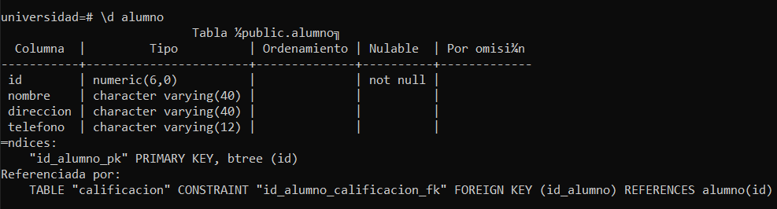
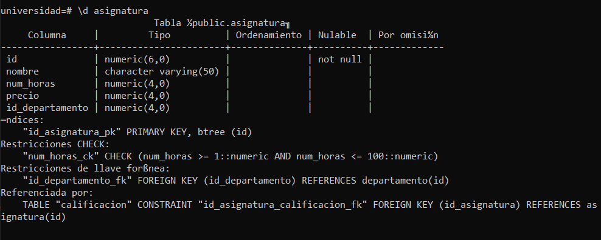
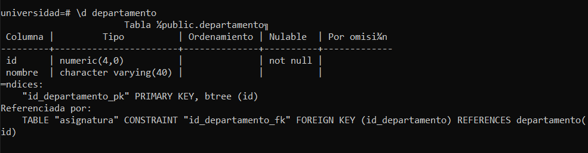
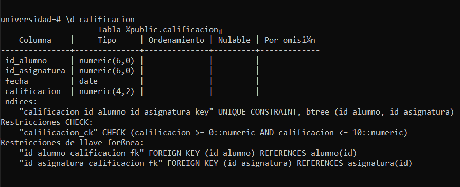
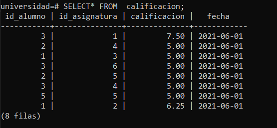

# PRÁCTICA UNIVERSIDAD

### **Se desea implementar el siguiente esquema de base de datos en una universidad.**

```sql
postgres=# create DATABASE universidad owner postgres;
CREATE DATABASE
postgres=# \c universidad postgres;
Ahora está conectado a la base de datos «universidad» con el usuario «postgres».
```

* **_Tabla alumno:_**

```sql
universidad=# CREATE TABLE alumno(
universidad(#     id NUMERIC(6),
universidad(#     nombre VARCHAR(40),
universidad(#     direccion VARCHAR(40),
universidad(#     telefono VARCHAR(12),
universidad(#
universidad(#     CONSTRAINT id_alumno_pk PRIMARY KEY(id)
universidad(# );
CREATE TABLE
```



* **_Tabla asignatura:_** 
```sql
universidad=# CREATE TABLE asignatura(
universidad(#     id NUMERIC(6),
universidad(#     nombre VARCHAR(50),
universidad(#     num_horas NUMERIC(4),
universidad(#     precio NUMERIC(4),
universidad(#     id_departamento NUMERIC(4),
universidad(#
universidad(#     CONSTRAINT id_asignatura_pk PRIMARY KEY(id),
universidad(#     CONSTRAINT num_horas_ck CHECK (num_horas BETWEEN 1 AND 100)
universidad(# );
CREATE TABLE
```



* **_Tabla departamento:_** 
```sql
universidad=# CREATE TABLE departamento(
universidad(#     id NUMERIC(4),
universidad(#     nombre VARCHAR(40),
universidad(#     CONSTRAINT id_departamento_pk PRIMARY KEY(id)
universidad(# );
CREATE TABLE
```



* **_Tabla calificación:_** 
```sql
universidad=# CREATE TABLE calificacion(
universidad(#     id_alumno NUMERIC(6),
universidad(#     id_asignatura NUMERIC(6),
universidad(#     fecha DATE,
universidad(#     calificacion NUMERIC(4,2),
universidad(#
universidad(#     UNIQUE (id_alumno, id_asignatura),
universidad(#     CONSTRAINT id_alumno_calificacion_fk FOREIGN KEY(id_alumno) REFERENCES alumno(id),
universidad(#     CONSTRAINT id_asignatura_calificacion_fk FOREIGN KEY(id_asignatura) REFERENCES asignatura(id),
universidad(#     CONSTRAINT calificacion_ck CHECK(calificacion BETWEEN 0 AND 10)
universidad(# );
CREATE TABLE
```


* **_Constraint añadido:_**
```sql
universidad=# ALTER TABLE asignatura ADD CONSTRAINT id_departamento_fk FOREIGN KEY(id_departamento) REFERENCES departamento(id);
ALTER TABLE
```

* _Insertar al alumnos:_

```sql
universidad=# INSERT INTO alumno VALUES (1, 'SANCHEZ HERMOSILLA, ALBERTO','HIGUERUELAS 12', 654782615), (2, 'ALBA TORDESILLAS, ANA MARIA', 'PICASSO 112', 632487559), (3, 'TORRES ALMAGRO, GUILLERMO', 'ALCALA 415', 651235674), (4, 'TORRES ALMAGRO, GUILLERMO', 'ALCALA 415', 651235674);
INSERT 0 4
```

* _Insertar las siguientes asignaturas y departamentos:_

```sql
universidad=# INSERT INTO departamento (id, nombre) VALUES (1,'PROGRAMACION'), (2, 'SISTEMAS OPERATIVOS'), (3, 'BASES DE DATOS');
INSERT 0 3
universidad-# VALUES (1,'FUNDAMENTOS DE LA PROGRAMACION', 100, 350.00, 1), (2, 'ELEMENTOS DE HARDWARE', 75, 200.00, 2), (3, 'PROGRAMACION AVANZADA EN JAVA', 100, 400.00, 1), (4, 'SISTEMAS OPERATIVOS MONOPUESTO', 100, 245.00, 2), (5, 'IMPLANTACION DE BASES DE DATOS', 90, 300.00, 3), (6, 'BASES DE DATOS NO RELACIONALES', 100, 800.00, 3);
INSERT 0 6
```
Comentario: He reducido el número de horas porque al escribir este ejercico en el **SQL shell** me daba error:
```sql
ERROR:  el nuevo registro para la relación «asignatura» viola la restricción «check» «num_horas_ck
```
Entonces bajé las horas por ir más rápido, pero en realidad tendría que cambiar la restriccición de la tabla.

* _Registrar las siguientes matrículas. Es decir, insertar en la tabla CALIFICACION los datos sin aún la fecha y la calificación (NULL):_

```sql
universidad=# INSERT INTO calificacion(id_alumno, id_asignatura)
universidad-# VALUES (2, 4), (1, 3), (3, 6), (1, 2), (2, 5), (3, 1), (3, 4);
INSERT 0 7
```

* _Matricular al siguiente alumno en ‘SISTEMAS OPERATIVOS MONOPUESTO’ e ‘IMPLANTACION DE BASES DE DATOS’. Usar los correspondientes asignatura_id para las asignaturas:_

```sql
universidad=# INSERT INTO alumno VALUES (5, 'ROMERO CIFUENTES, ELENA', 'MARCELO USERA 24', 624155975);
INSERT 0 1
universidad=# INSERT INTO calificacion VALUES (5, 5, '2021-02-09', NULL);
INSERT 0 1
```

* _Configurar todas las fechas de las calificaciones a ‘01/06/2021’. Para ello usar la función de conversión de cadenas a fechas TO_DATE(‘1/6/2021’):_

```sql
universidad=# UPDATE calificacion
universidad-# SET fecha = TO_DATE('01/06/2021', 'DD/MM/YY');
UPDATE 8
universidad=#
```

* _Configurar la calificación de la asignatura ‘ELEMENTOS DE HARDWARE’ a 6,25 al alumno cuyo id es igual a uno:_

```sql
universidad=# UPDATE calificacion
universidad-# SET calificacion = 6.25
universidad-# WHERE id_alumno = 1 AND id_asignatura = 2;
UPDATE 1
```

* _Asignar al alumno ‘TORRES ALMAGRO, GUILLERMO’ una nota de 7.50 en ‘FUNDAMENTOS DE PROGRAMACION’:_

```sql
universidad=# UPDATE calificacion
universidad-# SET calificacion = 7.5
universidad-# WHERE id_alumno = 3 AND id_asignatura = 1;
UPDATE 1
```

* _Dar aprobado general en la asignatura ‘BASES DE DATOS NO RELACIONALES’:_

```sql
universidad=# UPDATE calificacion
universidad-# SET calificacion = 5
universidad-# WHERE calificacion IS NULL;
UPDATE 6
```



* _Añadir a la base de datos la asignatura ‘PROGRAMACIÓN EN PYTHON’, con 200 horas de duración, un precio de 500,00 y adscrita al departamento cuyo id es 1:_

```sql
universidad=# INSERT INTO asignatura VALUES (7, 'PROGRAMACION EN PHYTON', 100, 500.00, 1);
INSERT 0 1
```

* _Matricular en ‘PROGRAMACIÓN EN PYTHON’ a los alumnos cuyo id es uno, tres y cinco:_

```sql
universidad=# INSERT INTO calificacion VALUES(1, 7, NULL, '11/02/2021'), (3, 7, NULL, '11/02/2021'), (5, 7, NULL, '11/02/2021');
INSERT 0 3
```

* _Actualizar los precios de las matrículas. Aumentar su precio un 5%:_

 **ANTES**
```sql
 universidad=# SELECT* FROM asignatura;
 id |             nombre             | num_horas | precio | id_departamento
----+--------------------------------+-----------+--------+-----------------
  1 | FUNDAMENTOS DE LA PROGRAMACION |       100 |    350 |               1
  2 | ELEMENTOS DE HARDWARE          |        75 |    200 |               2
  3 | PROGRAMACION AVANZADA EN JAVA  |       100 |    400 |               1
  4 | SISTEMAS OPERATIVOS MONOPUESTO |       100 |    245 |               2
  5 | IMPLANTACION DE BASES DE DATOS |        90 |    300 |               3
  6 | BASES DE DATOS NO RELACIONALES |       100 |    800 |               3
  7 | PROGRAMACION EN PHYTON         |       100 |    500 |               1
(7 filas)
```
 **DESPUÉS**
```sql
universidad=# UPDATE asignatura
universidad-# SET precio = ROUND(precio * 1.05, 2);
UPDATE 7
universidad=# SELECT* asignatura;
ERROR:  error de sintaxis en o cerca de «asignatura»
LÍNEA 1: SELECT* asignatura;
                 ^
universidad=# SELECT* FROM asignatura;
 id |             nombre             | num_horas | precio | id_departamento
----+--------------------------------+-----------+--------+-----------------
  1 | FUNDAMENTOS DE LA PROGRAMACION |       100 |    368 |               1
  2 | ELEMENTOS DE HARDWARE          |        75 |    210 |               2
  3 | PROGRAMACION AVANZADA EN JAVA  |       100 |    420 |               1
  4 | SISTEMAS OPERATIVOS MONOPUESTO |       100 |    257 |               2
  5 | IMPLANTACION DE BASES DE DATOS |        90 |    315 |               3
  6 | BASES DE DATOS NO RELACIONALES |       100 |    840 |               3
  7 | PROGRAMACION EN PHYTON         |       100 |    525 |               1
(7 filas)
```

* _Aumentar un 10% adicional a las asignaturas con menos de 100 horas lectivas:_

```sql
universidad=# UPDATE asignatura
universidad-# SET precio = ROUND(precio * 1.1, 2)
universidad-# WHERE num_horas < 100;
UPDATE 2
universidad=# SELECT* FROM asignatura;
 id |             nombre             | num_horas | precio | id_departamento
----+--------------------------------+-----------+--------+-----------------
  1 | FUNDAMENTOS DE LA PROGRAMACION |       100 |    368 |               1
  3 | PROGRAMACION AVANZADA EN JAVA  |       100 |    420 |               1
  4 | SISTEMAS OPERATIVOS MONOPUESTO |       100 |    257 |               2
  6 | BASES DE DATOS NO RELACIONALES |       100 |    840 |               3
  7 | PROGRAMACION EN PHYTON         |       100 |    525 |               1
  2 | ELEMENTOS DE HARDWARE          |        75 |    231 |               2
  5 | IMPLANTACION DE BASES DE DATOS |        90 |    347 |               3
(7 filas)
```

* _Reducir el precio de la matrícula 50,00 a las asignaturas adscritas al departamento ‘BASES DE DATOS’:_

```sql
universidad=# UPDATE asignatura
universidad-# SET precio = precio - 50.00
universidad-# WHERE id_departamento = 3;
UPDATE 2
universidad=# SELECT* FROM asignatura;
 id |             nombre             | num_horas | precio | id_departamento
----+--------------------------------+-----------+--------+-----------------
  1 | FUNDAMENTOS DE LA PROGRAMACION |       100 |    368 |               1
  3 | PROGRAMACION AVANZADA EN JAVA  |       100 |    420 |               1
  4 | SISTEMAS OPERATIVOS MONOPUESTO |       100 |    257 |               2
  7 | PROGRAMACION EN PHYTON         |       100 |    525 |               1
  2 | ELEMENTOS DE HARDWARE          |        75 |    231 |               2
  6 | BASES DE DATOS NO RELACIONALES |       100 |    790 |               3
  5 | IMPLANTACION DE BASES DE DATOS |        90 |    297 |               3
(7 filas)
```

* _Establecer las calificaciones no actualizadas (NULL) a cero. Usar la clausula ‘calificacion IS NULL’:_

```sql
universidad=# UPDATE calificacion
universidad-# SET calificacion = 0
universidad-# WHERE calificacion IS NULL;
UPDATE 3
universidad=# SELECT* FROM calificacion;
 id_alumno | id_asignatura | calificacion |   fecha
-----------+---------------+--------------+------------
         3 |             1 |         7.50 | 2021-06-01
         2 |             4 |         5.00 | 2021-06-01
         1 |             3 |         5.00 | 2021-06-01
         3 |             6 |         5.00 | 2021-06-01
         2 |             5 |         5.00 | 2021-06-01
         3 |             4 |         5.00 | 2021-06-01
         5 |             5 |         5.00 | 2021-06-01
         1 |             2 |         6.25 | 2021-06-01
         1 |             7 |         0.00 | 2021-02-11
         3 |             7 |         0.00 | 2021-02-11
         5 |             7 |         0.00 | 2021-02-11
(11 filas)
```

* _Realizar los cambios necesarios para eliminar el departamento ‘BASES DE DATOS’ y asignar las asignaturas que dirige a ‘PROGRAMACION’.:_

```sql
universidad=# UPDATE asignatura
universidad-# SET id_departamento = 1
universidad-# WHERE id_departamento = 3;
UPDATE 2
universidad=# SELECT* FROM asignatura;
 id |             nombre             | num_horas | precio | id_departamento
----+--------------------------------+-----------+--------+-----------------
  1 | FUNDAMENTOS DE LA PROGRAMACION |       100 |    368 |               1
  3 | PROGRAMACION AVANZADA EN JAVA  |       100 |    420 |               1
  4 | SISTEMAS OPERATIVOS MONOPUESTO |       100 |    257 |               2
  7 | PROGRAMACION EN PHYTON         |       100 |    525 |               1
  2 | ELEMENTOS DE HARDWARE          |        75 |    231 |               2
  6 | BASES DE DATOS NO RELACIONALES |       100 |    790 |               1
  5 | IMPLANTACION DE BASES DE DATOS |        90 |    297 |               1
(7 filas)


universidad=# DELETE FROM departamento WHERE id = 3;
DELETE 1
universidad=# SELECT* FROM departamento;
 id |       nombre
----+---------------------
  1 | PROGRAMACION
  2 | SISTEMAS OPERATIVOS
(2 filas)
```

